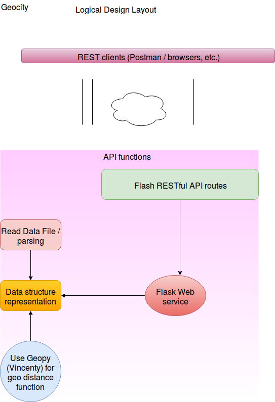

Geocity Module Repository
=========================

This simple project is an example to show proxmity on the cities given its geo latitude and longitude location.  And also do keyword querying on the cities.

Approach:
---------------
Used Flask for web routes as to create Rest API for this project.  Geo-city info was parsed and set to a user-defined class type representation.  Stored info in a dictionary for indexing.  This can carry over to big data with data warehousing techniques and cached using popular tools such as Whoosh, Apache-Lucene, solr, etc., but it's not in the scope here.  

Design:
--------

Steps:
--------
1. git clone https://github.com/thanhn9/geocity.git
2. cd geocity
3. make start 
which will install the packages and start-up the service

Please refer to document "apidoc.docx" for API info.  The file "apidoc.rst" was generated using a utility tool called 'pandoc' -- https://pandoc.org/MANUAL.html, i.e. 
$ pandoc -f docx apidoc.docx -t rst -o apidoc.rst
                         
Client tests:
-------------
For a UI to the Rest API calls, I think Postman did a good job.  Can refer to https://www.getpostman.com/.  At times, I used Python requests module and/or a browser will do, as these activities are mainly referred to the HTTP GET method.

Deployment
---------------
Open firewall to access github.com to access the above geocity.git repository.
For the instance/VM that needs to host these API functions, follow the above steps to deploy, using Chef/Ansible or scripting or which already has access to that instance/VM for configuration management.  May even setup a Jenkins job to ssh to the specified boxes for deployment.

✨🍰✨
